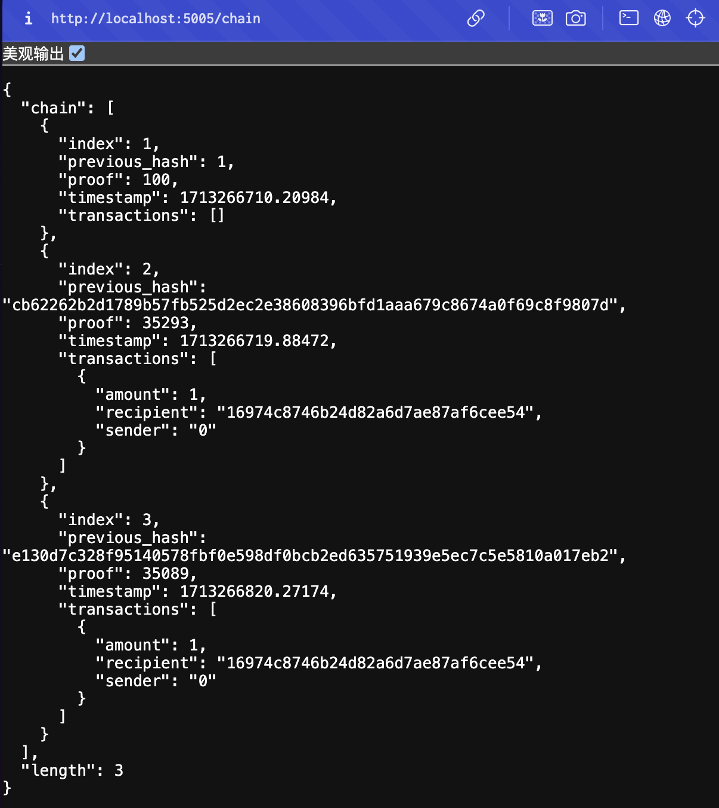

#### build a mini blockchain by python
```python
python blockchain.py
```

mine endpoint: http://localhost:5005/mine
full chain endpoint: http://localhost:5005/chain



step1: deploy with an address


step2: call method with litter eth, will revert


step3: call method with 1 eth, will success


step4: 0x5B call withdraw will occur error


step5: 0x61 call withdraw will success

